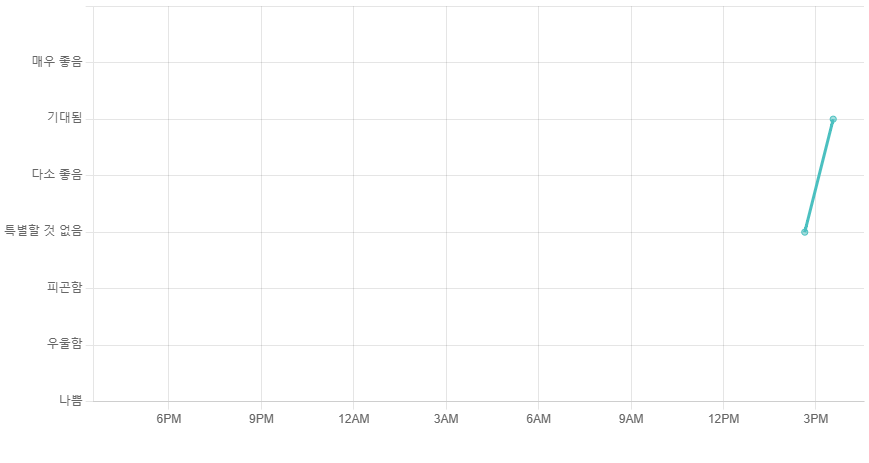
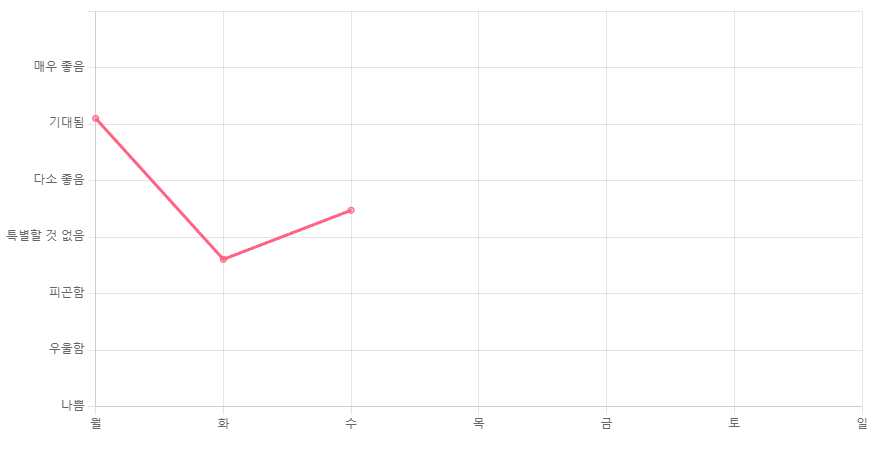

# 튜닝 차트 사용법

---

## 일간/주간 차트 변경 방법

```jsx
const ChartMode = {
  MODE : 0,
  DAILY: 0,
  WEEKLY: 1,
}
```

ChartMode의 Mode값이 DAILY와 같은 경우 24시간 도표를 사용한다 (24시간 전~현재)



Mode값이 WEEKLY인 경우 월~일의 일주일 체계 도표를 사용.



## 차트에 데이터를 추가하는 방법

### 📅 주간 차트에 데이터 추가

```jsx
actions[2].handler(myChart)
```

여기서 `myChart` 는 현재 생성된 도표의 변수 이름이며, 전역으로 선언되어있다.

### ⏰ 일간 차트에 데이터 추가 (시간별)

시간 기록 추가 (현재시간)

```jsx
actions[6].handler((new Date()).toISOString(), 5, myChart)
```

만약 시간을 바꿔서 추가하려면 다음과 같은 방식도 가능하다

시간 기록 추가 (1시간 전)

```jsx
actions[6].handler((new Date(Date.now() - 1 * 60 * 60 * 1000)).toISOString(), 5, myChart)
```